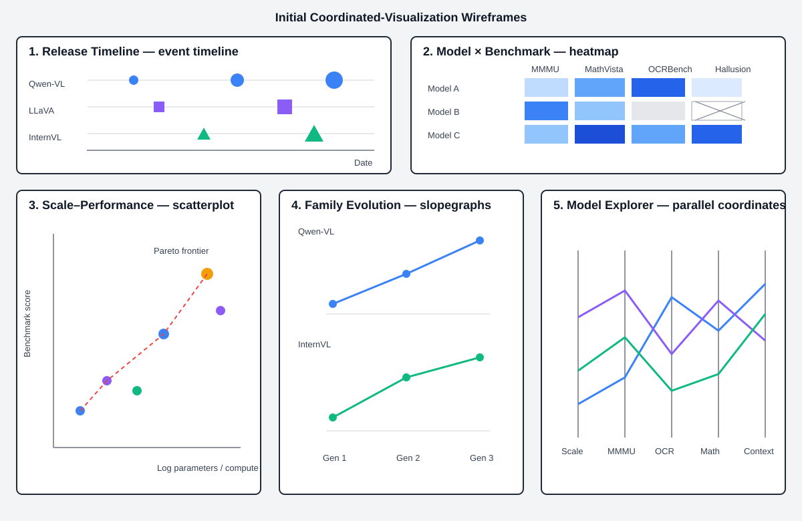

# From Pixels to Intelligence

## An Interactive History of Open-Weight Multimodal Large Language Models

**Group 7:** Sean Wan, Yuxuan Huang, Shilin Ou

## 1. Topic, Goals, and Questions

Multimodal large language models (MLLMs) integrate language with visual information for tasks such as image question answering, chart interpretation, document understanding, and visual reasoning. Their rapid development is usually presented through isolated announcements and leaderboards, obscuring how model scale, architecture, and capability have evolved together.

We will build an interactive visual history of major open-weight MLLMs released from 2023 through September 2026. “Open-weight” means that model weights are publicly downloadable, even if the model is not fully open-source. Our audience is students, researchers, and technical users seeking an accessible, evidence-based account of MLLM development.

The visualization will address five questions:

1. How have the release frequency, scale, architecture, and capabilities of open-weight MLLMs changed over time?
2. Within identical benchmark settings, how are parameter count and reported training resources associated with performance?
3. Which model families show the largest improvements between successive generations?
4. Which models lie on the empirical performance–resource frontier?
5. How do models differ across visual perception, knowledge, mathematical reasoning, document understanding, and hallucination-related evaluation?

These questions are exploratory: associations are not causal, and no benchmark completely measures intelligence.

## 2. Datasets

Benchmark results will primarily come from the [OpenVLM Leaderboard](https://huggingface.co/spaces/opencompass/open_vlm_leaderboard), maintained using OpenCompass’s [VLMEvalKit](https://github.com/open-compass/VLMEvalKit). We will select up to five benchmarks with sufficient model overlap, provisionally including MMMU, MathVista, MMBench, OCRBench, and HallusionBench. We will compare only results using the same benchmark version and evaluation metric.

Model metadata will come from Hugging Face model cards and APIs, official repositories, and model papers. Key attributes include release date, organization, family, language-model backbone, vision encoder, parameter counts, input modalities, context length, license, benchmark scores, and reported training data or compute.

Our initial source audit identified candidate families including LLaVA, Qwen-VL, InternVL, MiniCPM-V, Idefics, Molmo, and PaliGemma. We expect 30–50 models, 18–22 metadata variables, and 150–250 model–benchmark records. Included models must have downloadable weights, a verifiable release date, identifiable scale, and results on at least two selected benchmarks. Minor derivatives and duplicate submissions will be excluded.

Python and pandas will download, clean, reshape, and join the sources. A manually reviewed model-ID crosswalk will standardize names, dates, units, and benchmark versions. Missing values will remain explicit. A data dictionary and provenance table will record each field’s source, definition, and reliability.

## 3. Analysis and Visualization Methods

Processed data will be exported as compact CSV or JSON files for an interactive D3.js website. Five coordinated views will use distinct visualization idioms:

| View and idiom | Supported user task |
|---|---|
| Event timeline with family lanes | Identify release patterns and landmark models |
| Model-by-benchmark heatmap | Compare capability profiles and missing coverage |
| Log-scale scatterplot with Pareto frontier | Examine scale–performance relationships and outliers |
| Small-multiple family slopegraphs | Track changes between model generations |
| Parallel-coordinates model explorer | Compare selected models across multiple attributes |

Filters for date, organization, family, parameter range, and architecture will update all views. A selected model will be highlighted throughout. Tooltips will provide values, benchmark versions, missingness labels, and source links.

“Performance–resource efficiency” means membership on a Pareto frontier: no observed model achieves both higher performance and lower reported resource use. This is descriptive, not causal or production efficiency. Scores will not be combined unless their scales and protocols can be validly normalized.

## 4. Visualization Sketches

The following preliminary wireframe demonstrates that the five proposed views have distinct visual structures and coordinated analytical purposes.

1. **Timeline:** dated model markers arranged in horizontal family lanes, with shape encoding architecture type.
2. **Heatmap:** models as rows and benchmarks as columns; color represents score and crossed cells represent missing data.
3. **Frontier plot:** log parameters or compute on the x-axis and one selected benchmark on the y-axis, with the Pareto frontier annotated.
4. **Family slopegraphs:** one panel per family, connecting successive generations across a selected capability.
5. **Model explorer:** user-selected models shown across scale, capability, architecture, and training attributes.

The final sketches will additionally label all filters and linked interactions.

## 5. Group Roles and Responsibilities

**Sean Wan**, project lead, will coordinate scope and integration; develop the D3.js interface, linked interactions, timeline, and model explorer; and oversee final quality control.

**Yuxuan Huang** will acquire and validate model metadata, document inclusion decisions, construct architecture fields, and design the family-evolution views.

**Shilin Ou** will acquire benchmark results, audit benchmark comparability and the model-ID crosswalk, analyze missingness, and design the heatmap and frontier plot.

All members will review the data dictionary, test the interface, interpret results, maintain documentation, and prepare and rehearse the presentation.

## 6. Interim Presentation Deliverables

For the interim presentation, we will demonstrate a reproducible acquisition pipeline, reviewed model-ID crosswalk, documented dataset, benchmark-overlap and missingness analysis, five labeled wireframes, working D3.js timeline and frontier prototypes, and at least one linked filter. We will explain revisions motivated by exploratory analysis.

## 7. Timeline and Milestones

| Week | Milestone | Tasks | Owners | Expected output |
|---|---|---|---|---|
| 2 | Scope | Finalize corpus, questions, sources, and sketches | All; Sean leads | Proposal and five wireframes |
| 3 | Acquisition | Collect metadata and scores; build crosswalk | Yuxuan, Shilin | Integrated draft dataset |
| 4 | Validation | Audit coverage, versions, outliers, and designs | All | EDA notebook and data dictionary |
| 5 | Interim prototype | Build timeline, frontier plot, and linked filter | Sean; all test | Demonstrable D3.js prototype |
| 6 | Integration | Implement heatmap, slopegraphs, and explorer | All | Five coordinated views |
| 7 | Refinement | Conduct testing, document limitations, and rehearse | All | Final site, documentation, and presentation |
